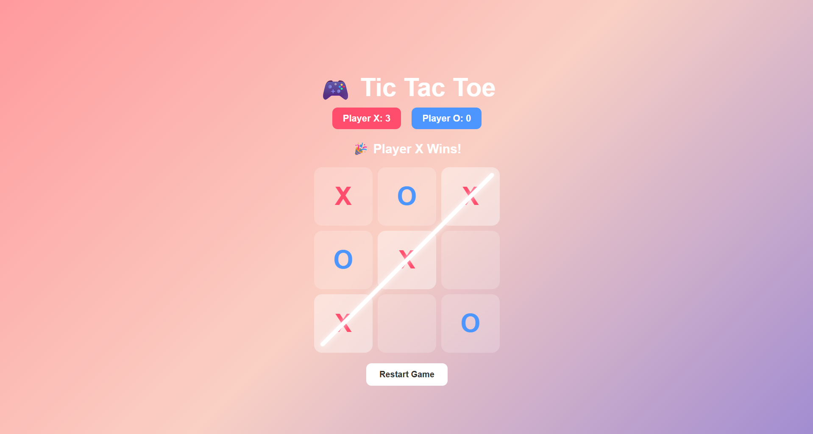

# 🎮 Tic Tac Toe Web Game

A simple and interactive Tic Tac Toe game built using HTML, CSS, and JavaScript.

## 📌 About the Project
This is a beginner-friendly web development project that allows two players to play Tic Tac Toe in a browser. The game includes basic win detection, draw handling, and a restart option.

## 🚀 Features
- Two-player gameplay (X and O)
- Interactive clickable grid
- Win detection logic
- Draw detection
- Restart game button
- Clean and responsive UI

## 🛠️ Tech Stack
- HTML
- CSS
- JavaScript

## 📂 Project Structure
- `index.html` → Structure of the game (UI layout)
- `style.css` → Styling and design of the game board
- `script.js` → Game logic (player moves, win detection, etc.)

## ▶️ How to Run
1. Download or clone this repository  
2. Open `index.html` in any web browser  
3. Start playing 🎮  

## 🎯 Purpose
This project was built as a practice project to improve my front-end development skills and understand basic JavaScript logic and DOM manipulation.

## 📸 Preview

## 📌 Future Improvements
- Add AI opponent 🤖  
- Add score tracking system  
- Improve UI animations  
- Make it mobile-friendly  

---

⭐ If you like this project, feel free to star the repository!
